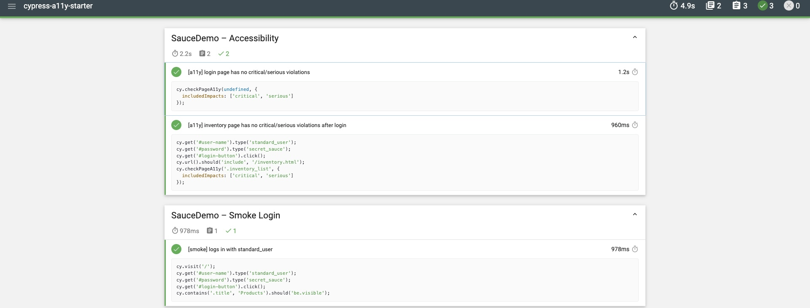

# Cypress Accessibility Starter


A sample Cypress automation framework demonstrating:

- ✅ End-to-end UI testing with **Cypress**
- ✅ Smoke & regression flows on [SauceDemo](https://www.saucedemo.com)
- ✅ Accessibility auditing with **axe-core** (`cypress-axe`)
- ✅ CI/CD integration with **GitHub Actions** (Chrome headless)
- ✅ Professional **Mochawesome HTML reports**

---

## 📂 Folder Structure
```
.github/workflows/ci.yml    # GitHub Actions workflow
cypress/
 ├─ e2e/
 │   ├─ a11y/               # Accessibility tests
 │   │   └─ saucedemo.a11y.cy.js
 │   └─ smoke/              # Smoke tests
 │       └─ saucedemo.login.cy.js
 ├─ fixtures/users.json     # Test data (valid/locked users)
 └─ support/                # Custom commands + setup
cypress.config.js           # Cypress + reporter config
package.json                # Dependencies + npm scripts
```

---

## 🚀 How to Run Locally

Clone the repo and install dependencies:
```bash
git clone https://github.com/Mittal237/cypress-a11y-starter.git
cd cypress-a11y-starter
npm install
```

Run all tests headless (CI style):
```bash
npm test
```

Run only smoke tests:
```bash
npm run test:smoke
```

Run only accessibility tests:
```bash
npm run test:a11y
```

Generate and open Mochawesome HTML report:
```bash
npm run report
open mochawesome-report/*.html   # (or start/xdg-open on Windows/Linux)
```

---

## 📊 Example Report

Here’s an example of the generated Mochawesome HTML report:



---

## ⚙️ CI/CD

This project is fully integrated with **GitHub Actions**.  
- Every push or pull request to `main` triggers the pipeline.  
- Tests run headless in Chrome.  
- Reports are uploaded as CI artifacts.  

## 🎯 Highlights

- Uses **Page Object patterns**, fixtures, and custom commands for maintainability.  
- Includes **accessibility checks** for critical/serious WCAG violations.  
- Produces clean **HTML test reports** for easy sharing.  
- Ready for **CI/CD pipelines**, showing continuous automated testing in action.  

---
